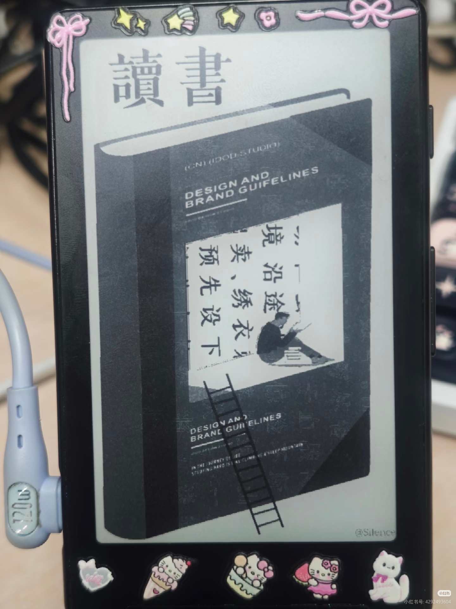

# 版本信息
本项目处于初步阶段，而且这是我第一次写固件，欢迎大家指导批评~

基于 **crosspoint 1.0.0** 版本修改而来，此版本稳定性及性能均有提升，感谢以下开源项目及其贡献者：

- 参考改版项目：[crosspoint-reader](https://github.com/crosspoint-reader/crosspoint-reader)
- 自选字体功能参考：[ruby-builds/crosspoint-reader (custom-fonts分支)](https://github.com/ruby-builds/crosspoint-reader/tree/feature/custom-fonts)
- 字体制作工具：[ZYFDroid/crosspointcn-fontcreator](https://github.com/ZYFDroid/crosspointcn-fontcreator)

---

# 当前进度

- **EPUB**：基本完成中文化适配
- **XTC**：实现动态管理功能
- **TXT**：目录解析逻辑如下：
  - 优先按“第n章”格式提取目录
  - 若无匹配目录或提取失败，则自动启用按字节分卷的兜底方案

---

# 阅读文本
第一建议阅读中文书籍

本版本改善了本项目上一版的英文分词逻辑，但是效果仍不是很理想

# 与原版不同：

目录页面：侧面键翻页，下面键选择选项

增加了透明壁纸

添加首行缩进、字距

txt阅读体验改善

添加坚果云云盘（方便大陆用户）

# 字体说明

## 内置字体
内置字体选用 **汉仪空山楷**。
英文字体保存**bookerly 18**。
  

## 自选字体

用户有两种方式制作字体：

python用户：

选用usetool/文件夹下的test_gui_v1.py进行字体转换

Windows用户：

[-] 选用[ZYFDroid/crosspointcn-fontcreator](https://github.com/ZYFDroid/crosspointcn-fontcreator)字体制作工具，制作后的字体在放置exe的文件夹下

转换完后放入fonts/文件夹中，具体可见：[ruby-builds/crosspoint-reader (custom-fonts分支)](https://github.com/ruby-builds/crosspoint-reader/tree/feature/custom-fonts)

网络用户：

[-] 自制字体网页（简陋版）：[字体网址](https://epdfontweb.streamlit.app/)，转换速度比客户端要慢。

格式：
字体名称.epdfont（无法调整大小，生成多大就是多大）

# 云端支持

## 下载书籍

设置-系统设置-坚果云信息配置 添加坚果云

主页-坚果云-联网下载

## 云端同步

### 开源阅读app

！！！开源阅读app需配置坚果云的webDav;

同步书籍：

开源阅读右上角三点--缓存/导出--离线缓存页面右上角三个点--点击导出到WebDav,选择导出格式为epub--选择书籍导出

同步进度：开源阅读【我的】--设置 备份与恢复--打开 同步阅读进度 

x4--打开要同步的epub,点击确认键，点击进度同步（开源阅读）--配置wifi--选择下载云端进度/上传云端进度

### 静读天下app
即将支持

# 刷机指导

1. 需要一根typec线连接你的电脑和x4
2. 下载release页面下的bin文件
3. 打开 https://xteink.dve.al/ 页面，在OTA fast flash controls部分选择下载好的bin文件，点击flash firmware from file
4. 先短按reset(sd卡附近），再长按电源键

首次刷机建议做好保存，在full flash controls界面下，选择save full flash，备份一下你的官方固件

# 传书
## wifi传书
按屏幕提示来即可

## OPDS传书
跟随原crosspoint项目说明书即可

## 坚果云传书
见上面云端支持说明

# 透明壁纸
效果：
<!-- 第一张图：宽度480px，高度自动等比缩放 -->

[制作本固件可识别的透明壁纸网址](https://blog.gdcba.cyou/xtc/)

[教程网址](http://xhslink.com/o/3BmHclU630Z)

# 常见问题

## 主页进入慢
主页自动生成封面，所以返回主页的时候时间会比较长，属于正常现象

## xtc封面生成

内存有限，实在是生成不了，写了个兜底方案：

选择睡眠壁纸为封面，进入一次睡眠后可生成xtc封面

## TXT
TXT目录会有识别不到的现象，因为现在仅支持一种章节：“第N章”

TXT建立章节索引，可识别“第n章”开头的章节目录，识别不了的会自动进入自动分卷

## xtc出现Memory error字样
没内存了

退出重启解决不了的话--字体选为系统自带字体（汉仪空山楷）--重启即可

## 问题解决
万事先重启

重启解决不了的，拔出sd卡，删除根目录下的.crosspoint文件夹

# 联系方式
可在小红书(4292493604)加群交流，也可以发邮件到gdby_mail@163.com,当然，最简单的是直接在github项目的讨论里发表看法

